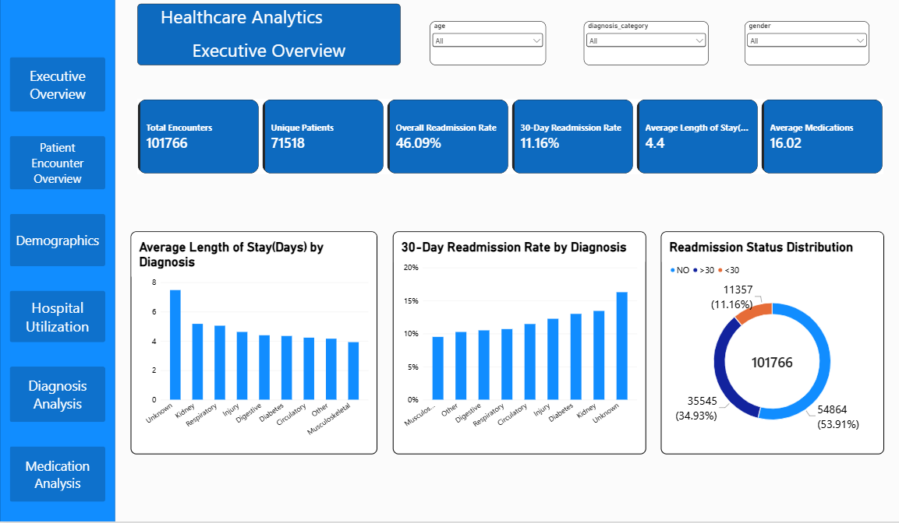

## Healthcare Analytics & Readmission Analysis

## Project Objective

The objective of this project is to analyze hospital encounter data to understand patient demographics, healthcare utilization, diagnosis patterns, medication usage, and repeat hospital visits.

The analysis focuses on identifying patterns associated with **30-day hospital readmissions**, including patient characteristics, encounter history, diagnoses, and medication-related factors. The findings are analyzed using data analytics techniques and presented through an **interactive Power BI dashboard** to support data-driven healthcare insights and readmission analysis.

## Dashboard Preview


## Tools & Technologies

* **Excel** – Quick visual inspection and initial understanding of the raw dataset
* **Python (Pandas)** – Data profiling, data cleaning, exploratory data analysis (EDA), and feature engineering
* **SQL (SQLite)** – Data analysis using aggregations, `GROUP BY`/`HAVING`, subqueries, CTEs, window functions (`LAG`, `DENSE_RANK`), joins, ranking, and views
* **Power Query** – Data transformation, conditional columns, data type validation, and created dashboard friendly categorical groups for reporting
* **DAX** – Creation of calculated measures and KPIs such as patient counts, readmission rates, utilization metrics, and medication metrics
* **Power BI** – Interactive dashboard development using KPI cards, charts, slicers, cross-filtering, and page navigation.

## Dataset Overview

The dataset contains **101,766 hospital encounters** involving **71,518 unique patients** with diabetes.

The dataset includes information related to:

* **Patient demographics** – age, gender, and race
* **Hospital encounter details** – encounter type and hospital utilization
* **Diagnosis information** – primary diagnosis and diagnosis categories
* **Hospital stay** – length of hospital stay
* **Prior healthcare utilization** – previous inpatient, outpatient, and emergency visits
* **Medication and insulin usage**
* **Hospital readmission status**

The original readmission outcome is categorized as:

* **`<30`** – Readmitted within 30 days
* **`>30`** – Readmitted after 30 days
* **`NO`** – No recorded readmission

## Data Cleaning & Preparation

The raw dataset was cleaned and prepared using **Python and Pandas** before performing the analysis.

Key data preparation steps included:

* Inspected dataset shape, column names, data types, missing values, and unique values
* Checked for duplicate records and data inconsistencies
* Analyzed missing-value percentages across columns
* Dropped the **Weight** column because approximately **96% of its values were missing**
* Replaced missing values in **Medical Specialty** with **“Unknown”**, as approximately **49% of the values were missing**
* Dropped **Payer Code** because approximately **39% of its values were missing** and the field was not relevant to the planned analysis
* Created a **Diagnosis Category** feature by converting diagnosis codes into more readable clinical categories for analysis
* Created a **30-day readmission indicator (`readmit_30`)**, where `1` represents readmission within 30 days and `0` represents no readmission within 30 days
* Created **total prior visits** by combining inpatient, outpatient, and emergency visit information
* Created a **medication change indicator**, where `1` represents a medication change and `0` represents no medication change
* Created a **high prior utilization indicator** based on prior visit counts
* Exported the prepared dataset for **SQL analysis and Power BI dashboard development**

## SQL Analysis

The cleaned dataset was loaded into **SQLite** to perform structured healthcare analysis using SQL.

Key analyses included:

* Calculated **total encounters and unique patients**
* Identified **repeat patients** and calculated the repeat-patient rate
* Calculated **average length of stay** and **average medications per encounter**
* Identified patients with the **highest hospital utilization**
* Analyzed **readmission patterns across diagnosis groups**
* Identified diagnosis groups with the **highest 30-day readmission rates**
* Compared **diagnosis-level 30-day readmission rates** with the overall hospital readmission rate
* Analyzed **average length of stay by diagnosis and readmission status**
* Compared **30-day readmission rates between patients with and without medication changes**
* Used `LAG()` to analyze **previous encounters within individual patient records**
* Used `DENSE_RANK()` to rank patients by **hospital utilization** and identify the second-highest utilization level
* Created a **SQL view** for downstream analytical reporting

SQL concepts used included **aggregations, GROUP BY, HAVING, subqueries, CTEs, joins, window functions, ranking functions, and views**.

## Power Query & Data Preparation

The prepared healthcare dataset was imported into **Power BI** and further transformed using **Power Query** before dashboard development.

Key steps included:

* Selected the **required columns** for dashboard analysis
* Verified **column headers and data types**
* Applied necessary **data transformations and preparation**
* Created dashboard-friendly conditional columns from engineered features
* Converted the `readmit_30` indicator into a **Readmission Status** category
* Converted the medication change indicator into **Medication Change / No Medication Change**
* Converted the prior utilization indicator into **High / Low Prior Utilization**
* Validated categorical fields such as **gender and diagnosis category**
* Prepared the final dataset for **Power BI visualization and analysis**

## DAX & KPI Development

DAX **measures and a calculated table** were created in Power BI to support healthcare KPI analysis and interactive dashboard reporting.

Key KPIs developed included:

* **Total Encounters**
* **Unique Patients**
* **Overall Readmission Rate**
* **30-Day Readmission Rate**
* **Average Length of Stay**
* **Average Medications per Encounter**
* **Repeat Patients**
* **Repeat Patient Rate**
* **Average Encounters per Patient**
* **Average Prior Visits**
* **Average Inpatient Visits**
* **Average Outpatient Visits**
* **Average Emergency Visits**
* **Medication-Changed Encounters**
* **Medication Change Rate**

DAX functions and concepts used included **COUNTROWS, DISTINCTCOUNT, SUM, AVERAGE, DIVIDE, CALCULATE, and filter context**.

A **Patient Encounters calculated table** was also created using `SUMMARIZE` to organize patient-level encounter information for further analysis.

### Patient-Level Calculated Table

The original dataset was at the **encounter level**, meaning a single patient could have multiple hospital encounters and therefore appear in multiple rows.

To perform patient-level analysis, I created a **Patient Encounters calculated table using the DAX `SUMMARIZE` function**. The table grouped the encounter-level data by **Patient ID** and calculated the **number of encounters for each patient**.

This transformed the analysis from the original **encounter level to the patient level**, allowing me to analyze patient encounter frequency and identify patients with the highest number of hospital encounters.

The calculated table was used specifically for **patient-level utilization analysis**, while the original encounter-level table remained available for encounter-level KPIs and analysis.

## Key Findings & Insights

* The dataset contains **101,766 hospital encounters** involving **71,518 unique patients**.
* **23.45% of patients** had more than one recorded hospital encounter.
* The **overall readmission rate was 46.09%**, while **11.16% of encounters** were associated with a readmission within 30 days.
* The average hospital stay was approximately **4.4 days per encounter**.
* An average of approximately **16 medications** were recorded per encounter.
* Prior hospital utilization varied across patients, with a smaller group showing substantially higher numbers of encounters.
* **30-day readmission rates varied across diagnosis categories**, indicating that observed readmission patterns differed between diagnosis groups.
* Encounters with a medication change had a **slightly higher observed 30-day readmission rate (11.82%)** compared with encounters without a medication change (**10.59%**).
* Patients with higher prior hospital utilization showed **different observed 30-day readmission patterns** compared with patients with lower prior utilization.

**Note:** These findings describe observed patterns and associations in the dataset and should not be interpreted as evidence of causal relationships.

## Project Workflow

**Raw Healthcare Dataset**
↓
**Excel** – Initial Visual Inspection
↓
**Python (Pandas)** – Data Profiling, Data Cleaning, EDA & Feature Engineering
↓
**Cleaned Analytical Dataset**
↓
**SQLite** – SQL Analysis & Healthcare Business Questions
↓
**Power Query** – Data Transformation, Column Selection & Dashboard Preparation
↓
**DAX** – KPI Measures & Patient-Level Analytical Table Development
↓
**Power BI** – Interactive 6-Page Healthcare Dashboard
↓
**Healthcare Insights** – Readmission, Patient Utilization, Diagnosis & Medication Patterns

## Project Structure

## Project Structure

```text
healthcare_data_analysis/
│
├── diabetic_data.csv
│   └── Raw healthcare dataset
│
├── raw_data.py
│   └── Python data profiling, cleaning, EDA and feature engineering
│
├── healthcare_data_cleaned.csv
│   └── Cleaned and analysis-ready dataset
│
├── healthcare_sql.sql
│   └── SQL queries for healthcare and readmission analysis
│
├── Healthcare_Analytics_Dashboard.pbix
│   └── Interactive 6-page Power BI dashboard
│
└── README.md
    └── Project documentation
```

## Business Questions Answered

The analysis was designed to answer key healthcare questions, including:

* How many hospital encounters and unique patients are present in the dataset?
* What percentage of patients have repeated hospital encounters?
* What is the average length of hospital stay?
* How many medications are recorded on average per encounter?
* Which patients have the highest number of hospital encounters?
* How do readmission patterns vary across diagnosis groups?
* Which diagnosis groups have the highest 30-day readmission rates?
* Which diagnosis groups have 30-day readmission rates above the overall hospital rate?
* How do 30-day readmission patterns differ across levels of prior hospital utilization?
* How does average length of stay vary by diagnosis and readmission status?
* Is medication change associated with differences in 30-day readmission rates?
* How do patient demographics, including age, gender, and race, vary across the dataset?

## Limitations

* The dataset does not contain actual admission and discharge dates, so a true chronological patient timeline could not be constructed.
* Encounter IDs were available to identify individual encounters but should not be interpreted as confirmed timestamps or chronological ordering.
* The analysis identifies patterns and associations within the available data and does not establish causal relationships.
* Medication changes may be associated with patient severity or other clinical factors; therefore, differences in readmission rates should not be interpreted as evidence that medication changes cause readmission.
* Prior utilization fields represent historical utilization information available within the dataset and should be interpreted according to the dataset's structure and definitions.
* The project focuses on **descriptive and diagnostic analytics** rather than developing a predictive model for future readmissions.


## Future Improvements

Potential extensions of this project include:

* Explore predictive modeling for 30-day readmission as a future extension.
* Perform statistical testing to assess whether observed differences between patient groups are statistically significant.
* Incorporate actual admission and discharge dates to enable time-based and longitudinal patient analysis.
* Include additional clinical variables for deeper patient-level analysis.
* Expand the Power BI dashboard with additional healthcare KPIs and drill-through analysis.
* Extend the dashboard into an interactive application for broader healthcare analytics and reporting.


